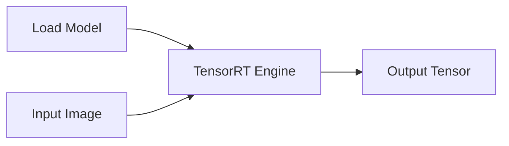
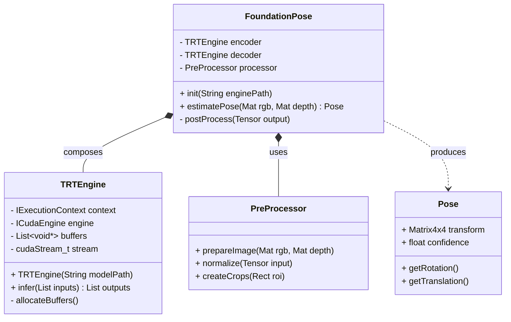

# foundation-pose-trt
TensorRT Implementation for FoundationPose

## Architecture

> Sequence Diagram



> Class Diagram



## Command to convert onnx model to `TensorRT`

```bash
./scripts/convert_onnx.sh onnx/yolo_model_100_static.onnx model_rtx3060.engine
```

## Command to execute the trt engine

```bash
ros2 run foundation_pose trt_engine_node
```

## Acknowledgement

- https://github.com/ika-rwth-aachen/ros2-depth-anything-v3-trt
- https://github.com/NVIDIA-ISAAC-ROS/isaac_ros_pose_estimation
